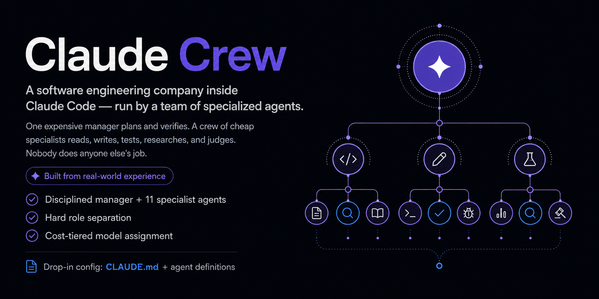
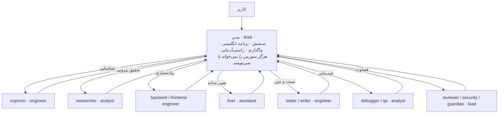

<div align="center">



# Claude Crew

**یک شرکت مهندسی نرم‌افزار داخل Claude Code: یک مدیر و دوازده ایجنت تخصصی.**

*مدیر برنامه‌ریزی، تقسیم کار و راستی‌آزمایی می‌کند. ایجنت‌های تخصصی می‌خوانند، می‌نویسند، تست می‌کنند، تحقیق می‌کنند، عیب را پیدا می‌کنند و درباره نتیجه قضاوت می‌کنند. مرز هر نقش مشخص است.*

> **بر پایه تجربه واقعی** کار روزمره با Claude Code ساخته شده است؛ یعنی بر اساس چیزهایی که واقعاً نرم‌افزار سالم را خراب می‌کنند یا در زمان و توکن صرفه‌جویی می‌کنند، نه یک کانفیگ نمایشی.

[](README.md)
[](README.fa.md)


[**پیش‌نمایش زنده ← https://miladjs.github.io/claude-crew/**](https://miladjs.github.io/claude-crew/)

</div>

---

## Claude Crew چیست؟

Claude Crew یک جلسه Claude Code را به تیمی منظم تبدیل می‌کند. یک مدیر درخواست را می‌سنجد، بر پایه اطلاعات واقعی برنامه می‌چیند، کار را واگذار می‌کند و نتیجه را راستی‌آزمایی می‌کند. دوازده ایجنت تخصصی مسئول شناسایی کدبیس، پیاده‌سازی، تست، تحقیق، عیب‌یابی، بازبینی، امنیت، جلوگیری از رگرسیون و نگارش‌اند.

نصب آن مستقیم است: یک `CLAUDE.md` مستقل از استک، دوازده تعریف ایجنت مستقل از استک، یک پروفایل استک و یک نمونه تنظیمات گیت‌وی. به fork، plugin یا build جداگانه نیازی نیست.

## شخصی‌سازی استک فقط در یک فایل

> **پروفایل پیش‌فرض همراه مخزن TypeScript / Next.js App Router / Express / Tailwind CSS / رابط فارسی RTL است.**

برای استفاده از هر استک دیگری فقط این فایل را ویرایش کنید:

```text
skills/stack-profile/SKILL.md
```

این فایل تنها محل شخصی‌سازی رفتار پروژه است و موارد زیر را تعیین می‌کند:

- **زبان پاسخ:** زبان و لحن پاسخ مدیر؛ در پروفایل پیش‌فرض فارسی است.
- **استک اصلی:** زبان‌ها، فریم‌ورک‌ها و سیستم styling اصلی پروژه.
- **استک‌های ثانویه:** فناوری‌های دیگری که ممکن است در پروژه دیده شوند.
- **قواعد UI:** جهت چیدمان، styling، زبان copy، مدیریت متن دوجهته و الزامات accessibility.
- **بخش‌های پرریسک:** نقاطی که ممکن است بی‌سروصدا خراب شوند و workflow سطح `HIGH` و `guardian` را فعال می‌کنند.
- **تست و type-check:** test runner موجود و دستورهای دقیق راستی‌آزمایی.

مدیر این پروفایل را پیش از سنجش **همه کارها، حتی `TRIVIAL`** بارگذاری می‌کند، به زبان تعیین‌شده در آن پاسخ می‌دهد و قواعد مرتبط را در prompt تک‌تک ایجنت‌ها می‌گذارد. برای تغییر استک، `CLAUDE.md` یا فایل‌های ایجنت را ویرایش نکنید.

## چرا ساخته شده است؟

ساختارهای تک‌ایجنتی معمولاً از دو طرف شکست می‌خورند:

- **هزینه بیهوده:** مدل گران فایل می‌خواند، کدبیس را جست‌وجو می‌کند و تغییر یک‌خطی انجام می‌دهد؛ کاری که باید واگذار می‌شد.
- **خرابی بی‌صدا:** یک ایجنت همه‌کاره تمرکزش را از دست می‌دهد، رفتار نامرتبطی را تغییر می‌دهد یا رگرسیونی را نمی‌بیند که خطای واضحی ندارد.

Claude Crew با تفکیک سخت نقش‌ها و تخصیص هزینه بر اساس مسئولیت، جلوی هر دو را می‌گیرد. هر قابلیت فقط یک صاحب دارد و مقدار فرایند متناسب با ریسک تغییر است.

## سازوکار



مدیر به زبان پاسخ تعیین‌شده در `skills/stack-profile/SKILL.md` جواب می‌دهد؛ زبان پروفایل پیش‌فرض فارسی است. برای کارهای `NORMAL` و `HIGH`، برنامه داخلی و prompt ایجنت‌ها را به انگلیسی می‌نویسد و آن‌ها را بر گزارش واقعی `explorer` و `researcher` بنا می‌کند، نه بر حدس درباره کد.

## نام نقش‌ها و شناسه مدل‌ها

Claude Crew برای تفکیک هزینه و مسئولیت چهار نام نقش دارد. این نام‌ها slot داخلی Claude Code نیستند.

| نام نقش | کاربرد | شناسه مستقیم مدل در این مخزن |
|---|---|---|
| `lead` | مدیریت، بازبینی، امنیت و درگاه رگرسیون | `claude-lead` |
| `engineer` | شناسایی، پیاده‌سازی، تست و نگارش | `claude-engineer` |
| `analyst` | تحقیق بیرونی، ریشه‌یابی و باگ‌یابی | `claude-analyst` |
| `assistant` | تغییرات کم‌ریسک، تک‌فایلی و `TRIVIAL` | `claude-assistant` |

slotهای داخلی Claude Code و شناسه‌های مستقیم فایل ایجنت دو مسیر جدا دارند:

- متغیرهایی مثل `ANTHROPIC_DEFAULT_OPUS_MODEL`، `ANTHROPIC_DEFAULT_SONNET_MODEL`، `ANTHROPIC_DEFAULT_HAIKU_MODEL` و `ANTHROPIC_DEFAULT_FABLE_MODEL` تعیین می‌کنند وقتی Claude Code یک slot داخلی را درخواست کرد، کدام شناسه مدل روتر استفاده شود.
- همه فایل‌های ایجنت در این مخزن داخل فیلد `model:` یک **شناسه کامل و مستقیم** دارند؛ برای نمونه `model: claude-engineer`. این شناسه‌های مستقیم از نگاشت `ANTHROPIC_DEFAULT_*_MODEL` عبور نمی‌کنند.
- مقدار `model` مدیر در `settings.example.json` نیز یک شناسه مستقیم است.

روتر باید همه شناسه‌های مستقیم مدیر و ایجنت‌ها را دقیقاً ارائه کند. اگر نام‌گذاری روتر فرق دارد، روی روتر alias متناظر بسازید یا مقدارهای مستقیم `model:` را جداگانه تغییر دهید. روی fallback مستندنشده حساب نکنید؛ این مخزن رفتار fallback بی‌صدای شناسه نامعتبر را تأیید یا تضمین نمی‌کند.

## اعضای تیم

| ایجنت | نام نقش | مسئولیت |
|---|---|---|
| `explorer` | `engineer` | کدبیس را می‌شناسد و گزارش ساختاریافته و فقط‌خواندنی می‌دهد |
| `backend` | `engineer` | API، منطق کسب‌وکار، دسترسی به داده، احراز هویت و integrationها را پیاده‌سازی می‌کند |
| `frontend` | `engineer` | UI، component، styling، state، form و accessibility را پیاده‌سازی می‌کند |
| `tester` | `engineer` | تست‌های خودکار و متمرکز را می‌نویسد و اجرا می‌کند |
| `writer` | `engineer` | مستندات، نثر و copy را به زبان تعیین‌شده در پروفایل می‌نویسد |
| `researcher` | `analyst` | مستندات بیرونی، APIها، خطاها و تفاوت نسخه‌ها را بررسی می‌کند |
| `debugger` | `analyst` | وقتی علت واضح نیست، ریشه خطا را عمیق بررسی می‌کند |
| `qa` | `analyst` | edge case، race condition و مسیرهای شکست گزارش‌نشده را پیدا می‌کند |
| `reviewer` | `lead` | تغییر کامل‌شده را سخت‌گیرانه بازبینی و عیب‌ها را گزارش می‌کند |
| `security` | `lead` | مرزهای اعتماد، authorization، ورودی، افشای داده و integrationها را ممیزی می‌کند |
| `guardian` | `lead` | پیش و پس از تغییر پرریسک baseline رگرسیون را ثبت و بررسی می‌کند |
| `fixer` | `assistant` | برای کار `TRIVIAL` فقط چند خط واضح و کم‌ریسک را در یک فایل تغییر می‌دهد |

## گردش‌کار

مدیر هر کار را در یکی از سطح‌های `TRIVIAL`، `NORMAL` یا `HIGH` قرار می‌دهد و زنجیره مناسب را اجرا می‌کند:

```text
TRIVIAL   [اگر مسیر نامعلوم بود explorer] → fixer → reviewer → پایان
NORMAL    explorer → برنامه انگلیسی → implementer → reviewer ∥ tester → پایان
HIGH      explorer → guardian PRE → برنامه انگلیسی → implementer → tester → reviewer → security* → guardian POST → پایان
RESEARCH  هرجا اطلاعات بیرونی لازم باشد، researcher پیش از برنامه انگلیسی اضافه می‌شود
```

`security*` زمانی اجرا می‌شود که کار به احراز هویت، authorization، ورودی نامطمئن، افشای داده، پرداخت، upload، integration بیرونی یا سطح عمومی مربوط باشد. محرک‌های وابسته به فریم‌ورک در پروفایل استک تعریف می‌شوند. پروفایل پیش‌فرض، مرزهای rendering و caching و routing در Next.js، ترتیب middleware در Express، layout مشترک، schema دیتابیس، تنظیمات محیط، احراز هویت و شکل پاسخ API عمومی را پرریسک می‌داند.

## نصب سریع

سیستم‌عامل را انتخاب کنید. هر روش فایل قوانین مدیر، هر دوازده ایجنت، پروفایل استک داخل `skills` و نمونه تنظیمات گیت‌وی را کپی می‌کند.

<details open>
<summary><b>macOS</b></summary>

در Terminal اجرا کنید:

```bash
git clone https://github.com/miladjs/claude-crew.git
cd claude-crew
mkdir -p ~/.claude
cp CLAUDE.md ~/.claude/CLAUDE.md
cp -r agents ~/.claude/
cp -r skills ~/.claude/
cp settings.example.json ~/.claude/settings.json
```

فایل `~/.claude/settings.json` را باز کنید، `ANTHROPIC_BASE_URL` و `ANTHROPIC_AUTH_TOKEN` را مقدار دهید و Claude Code را restart کنید. برای تغییر استک پیش‌فرض فقط `~/.claude/skills/stack-profile/SKILL.md` را ویرایش کنید.

اگر متغیرهای گیت‌وی را با `export` تنظیم کنید، فقط در terminalهایی فعال‌اند که آن متغیرها را بارگذاری کرده‌اند. استفاده از `settings.json` این وابستگی به نشست shell را از بین می‌برد.

</details>

<details>
<summary><b>Windows</b></summary>

در PowerShell اجرا کنید:

```powershell
git clone https://github.com/miladjs/claude-crew.git
cd claude-crew
New-Item -ItemType Directory -Force "$env:USERPROFILE\.claude" | Out-Null
Copy-Item CLAUDE.md "$env:USERPROFILE\.claude\CLAUDE.md"
Copy-Item -Recurse -Force agents "$env:USERPROFILE\.claude\agents"
Copy-Item -Recurse -Force skills "$env:USERPROFILE\.claude\skills"
Copy-Item settings.example.json "$env:USERPROFILE\.claude\settings.json"
```

فایل `%USERPROFILE%\.claude\settings.json` را باز کنید، `ANTHROPIC_BASE_URL` و `ANTHROPIC_AUTH_TOKEN` را مقدار دهید و Claude Code را restart کنید. برای تغییر استک پیش‌فرض فقط `%USERPROFILE%\.claude\skills\stack-profile\SKILL.md` را ویرایش کنید.

</details>

<details>
<summary><b>Linux</b></summary>

در terminal اجرا کنید:

```bash
git clone https://github.com/miladjs/claude-crew.git
cd claude-crew
mkdir -p ~/.claude
cp CLAUDE.md ~/.claude/CLAUDE.md
cp -r agents ~/.claude/
cp -r skills ~/.claude/
cp settings.example.json ~/.claude/settings.json
```

فایل `~/.claude/settings.json` را باز کنید، `ANTHROPIC_BASE_URL` و `ANTHROPIC_AUTH_TOKEN` را مقدار دهید و Claude Code را restart کنید. برای تغییر استک پیش‌فرض فقط `~/.claude/skills/stack-profile/SKILL.md` را ویرایش کنید.

</details>

## گیت‌وی سفارشی: OmniRoute، 9Router یا OpenRouter

Claude Code می‌تواند به گیت‌وی سازگار با Anthropic Messages API وصل شود و نیازی به تغییر باینری آن نیست.

گزینه‌های گیت‌وی:

- **OmniRoute:** [omniroute.online](https://omniroute.online/) · [GitHub](https://github.com/diegosouzapw/OmniRoute)
- **9Router:** [9router.com](https://9router.com/) · [GitHub](https://github.com/decolua/9router)
- **OpenRouter:** [openrouter.ai](https://openrouter.ai/)

در مستندات گیت‌وی انتخابی، آدرس پایه، نیاز یا عدم نیاز به `/v1`، روش احراز هویت، سازگاری با Anthropic API و شناسه مدل‌های موجود را بررسی کنید.

### متغیرهای گیت‌وی

| متغیر | کاربرد |
|---|---|
| `ANTHROPIC_BASE_URL` | آدرس پایه روتر. بعضی روترها به پسوند `/v1` نیاز دارند و بعضی ندارند. |
| `ANTHROPIC_AUTH_TOKEN` | توکن ارسالی به گیت‌وی سفارشی. روش احراز هویت را با مستندات همان گیت‌وی تطبیق دهید. |
| `ANTHROPIC_DEFAULT_OPUS_MODEL` | شناسه روتر برای slot داخلی `opus`؛ شناسه مستقیم ایجنت را نگاشت نمی‌کند. |
| `ANTHROPIC_DEFAULT_SONNET_MODEL` | شناسه روتر برای slot داخلی `sonnet`؛ شناسه مستقیم ایجنت را نگاشت نمی‌کند. |
| `ANTHROPIC_DEFAULT_HAIKU_MODEL` | شناسه روتر برای slot داخلی `haiku`؛ شناسه مستقیم ایجنت را نگاشت نمی‌کند. |
| `ANTHROPIC_DEFAULT_FABLE_MODEL` | شناسه روتر برای slot داخلی `fable`؛ شناسه مستقیم ایجنت را نگاشت نمی‌کند. |
| `ANTHROPIC_CUSTOM_MODEL_OPTION` | شناسه‌ای که در گزینه custom model در Claude Code نمایش داده می‌شود. |
| `CLAUDE_CODE_ENABLE_GATEWAY_MODEL_DISCOVERY` | مقدار `"1"` به Claude Code اجازه می‌دهد فهرست مدل‌های روتر را درخواست کند. |
| `CLAUDE_CODE_DISABLE_UNKNOWN_MODEL_WINDOW_ENFORCEMENT` | وقتی شناسه‌های گیت‌وی در اطلاعات داخلی Claude Code نیستند، مقدار `"1"` بگذارید. |
| `CLAUDE_CODE_DISABLE_EXPERIMENTAL_BETAS` | برای روتری که headerهای experimental beta را پشتیبانی نمی‌کند، مقدار `"1"` بگذارید. |

### تفاوت slot داخلی و شناسه مستقیم

slot داخلی از متغیر مدل پیش‌فرض عبور می‌کند:

```text
Claude Code internal slot: opus
        ↓ ANTHROPIC_DEFAULT_OPUS_MODEL
Router model ID
```

ایجنت‌های این مخزن به‌دلیل داشتن شناسه کامل در frontmatter از این نگاشت عبور نمی‌کنند:

```text
agents/reviewer.md
model: claude-lead
        ↓ direct request
Router model ID: claude-lead
```

روتر باید `claude-lead`، `claude-engineer`، `claude-analyst` و `claude-assistant` را دقیقاً ارائه کند؛ مگر اینکه شناسه‌های مستقیم مدیر و ایجنت‌ها را تغییر دهید.

### روش ۱: `settings.json`؛ پیشنهادشده

`settings.example.json` را در `~/.claude/settings.json` کپی و placeholderها را جایگزین کنید:

```json
{
  "env": {
    "ANTHROPIC_BASE_URL": "https://your-gateway-host",
    "ANTHROPIC_AUTH_TOKEN": "sk-your-own-token",
    "ANTHROPIC_DEFAULT_OPUS_MODEL": "claude-lead",
    "ANTHROPIC_DEFAULT_SONNET_MODEL": "claude-engineer",
    "ANTHROPIC_DEFAULT_HAIKU_MODEL": "claude-analyst",
    "ANTHROPIC_DEFAULT_FABLE_MODEL": "claude-assistant",
    "ANTHROPIC_CUSTOM_MODEL_OPTION": "claude-assistant",
    "CLAUDE_CODE_ENABLE_GATEWAY_MODEL_DISCOVERY": "1",
    "CLAUDE_CODE_DISABLE_EXPERIMENTAL_BETAS": "1",
    "CLAUDE_CODE_DISABLE_UNKNOWN_MODEL_WINDOW_ENFORCEMENT": "1"
  },
  "model": "claude-lead"
}
```

مقدار سطح بالای `model` شناسه مستقیم مدل مدیر را انتخاب می‌کند. متغیرهای slot پیش‌فرض برای قابلیت‌هایی از Claude Code کاربرد دارند که slot داخلی درخواست می‌کنند؛ آن‌ها شناسه مستقیم ایجنت‌ها را بازنویسی نمی‌کنند.

### روش ۲: متغیرهای محیطی shell

برای نمونه در `~/.zshrc` در macOS:

```bash
export ANTHROPIC_BASE_URL="https://your-gateway-host"
export ANTHROPIC_AUTH_TOKEN="sk-your-own-token"
export ANTHROPIC_DEFAULT_OPUS_MODEL="claude-lead"
export ANTHROPIC_DEFAULT_SONNET_MODEL="claude-engineer"
export ANTHROPIC_DEFAULT_HAIKU_MODEL="claude-analyst"
export ANTHROPIC_DEFAULT_FABLE_MODEL="claude-assistant"
export ANTHROPIC_CUSTOM_MODEL_OPTION="claude-assistant"
export CLAUDE_CODE_ENABLE_GATEWAY_MODEL_DISCOVERY="1"
export CLAUDE_CODE_DISABLE_EXPERIMENTAL_BETAS="1"
export CLAUDE_CODE_DISABLE_UNKNOWN_MODEL_WINDOW_ENFORCEMENT="1"
```

shell را دوباره بارگذاری کنید:

```bash
source ~/.zshrc
```

متغیرهای محیطی shell بر مقدارهای `settings.json` اولویت دارند. برای جلوگیری از تداخل، یکی از دو روش را یکدست استفاده کنید.

### بررسی اتصال

Claude Code را restart کنید و یک پیام کوتاه بفرستید. اگر احراز هویت یا انتخاب مدل خطا داد، آدرس پایه، نیاز به `/v1`، اعتبار توکن و ارائه دقیق هر شناسه مستقیم روی روتر را بررسی کنید. شناسه نامعتبر را خطای کانفیگ در نظر بگیرید و fallback را فرض نکنید.

## امنیت

- `settings.json` واقعی را commit نکنید؛ ممکن است اطلاعات احراز هویت داشته باشد. فقط `settings.example.json` باید در version control باشد.
- فایل `.gitignore` مخزن، `settings.json` را نادیده می‌گیرد؛ این قاعده را نگه دارید.
- برای هر عضو تیم توکن جدا بسازید و یک credential را مشترک استفاده نکنید.

## Hooks

کانفیگ محلی اولیه دو hook داشت: `guard.sh` برای Bash و `quality.sh` برای Edit/Write. این scriptها در مخزن نیستند، چون به مسیرهای محلی کاربر وابسته بودند. اگر به آن‌ها نیاز دارید، نسخه خودتان را با مسیرهای نسبی و قابل‌حمل اضافه کنید.

## ساختار مخزن

```text
.
├── CLAUDE.md                         # قوانین و workflowهای مستقل از استک برای مدیر
├── agents/                           # 12 تعریف مستقل از استک برای ایجنت‌های تخصصی
├── skills/
│   └── stack-profile/
│       └── SKILL.md                  # تنها فایل شخصی‌سازی استک و قواعد پروژه
├── settings.example.json             # نمونه تنظیمات گیت‌وی بدون credential واقعی
├── .gitignore                        # جلوگیری از ورود settings.json به version control
├── LICENSE                           # لایسنس MIT
├── README.md                         # مستندات انگلیسی
├── README.fa.md                      # مستندات فارسی
├── index.html                        # صفحه فرود دوزبانه GitHub Pages
├── .nojekyll                         # غیرفعال‌کردن Jekyll برای GitHub Pages
└── assets/                           # تصویر کاور و favicon
    ├── claude-crew-cover.png         # تصویر کاور
    └── favicon.svg                   # favicon سایت
```

---

<div align="center">

برای تیم‌هایی ساخته شده که Claude Code را جدی می‌گیرند.

**ساخته [Milad Roknadini](https://miladjs.com)** · [miladjs.com](https://miladjs.com) · [English](README.md)

<sub>© ۲۰۲۶ Milad Roknadini — منتشرشده تحت لایسنس MIT.</sub>

</div>
