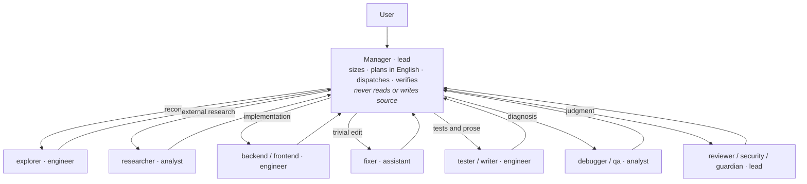

<div align="center">


# Claude Crew

**A software engineering company inside Claude Code: one manager and twelve specialist agents.**

*The manager plans, dispatches, and verifies. Specialists read, write, test, research, diagnose, and judge. Each role has a hard boundary.*

> **Built from real-world experience** using Claude Code day to day—shaped by what actually breaks working software and what actually saves time and tokens, not by a toy configuration.

[](README.md)
[](README.fa.md)


[**Live demo → https://miladjs.github.io/claude-crew/**](https://miladjs.github.io/claude-crew/)

</div>

---

## What is Claude Crew?

Claude Crew turns one Claude Code session into a disciplined engineering team. One manager scopes each request, builds grounded plans, delegates the work, and verifies the result. Twelve specialist agents own reconnaissance, implementation, tests, research, diagnosis, review, security, regression protection, and prose.

It is a drop-in configuration: a stack-neutral `CLAUDE.md` rulebook, twelve stack-neutral agent definitions, one stack profile, and a gateway settings template. There is no fork, plugin, or build step.

## Customize the stack in one file

> **The bundled default profile is TypeScript / Next.js App Router / Express / Tailwind CSS / Persian RTL.**

To use another stack, edit only:

```text
skills/stack-profile/SKILL.md
```

That file is the sole customization surface for project behavior. It defines:

- **Response language:** the language and register the manager uses when replying; the default is Persian.
- **Primary stack:** the main languages, frameworks, and styling system.
- **Secondary stacks:** any additional technologies the crew may encounter.
- **UI conventions:** layout direction, styling rules, copy language, bidirectional-text handling, and accessibility requirements.
- **High-risk areas:** the project's silent-failure zones that trigger the `HIGH` workflow and `guardian`.
- **Tests and type-checking:** the existing test runner and the exact verification commands.

The manager loads this profile before sizing **every task, including `TRIVIAL`**, replies in its configured response language, and passes every relevant rule into every agent prompt. Do not edit `CLAUDE.md` or the agent definitions to change stacks.

## Why it exists

Single-agent setups tend to fail in two directions:

- **Wasted spend:** a premium model reads files, searches the codebase, and applies one-line fixes that should have been delegated.
- **Silent breakage:** a general-purpose agent loses focus, changes unrelated behavior, or misses a regression that produces no obvious error.

Claude Crew addresses both with hard role separation and cost-aware model assignment. Each capability belongs to one agent, while the amount of ceremony scales with the risk of the change.

## How it works



The manager replies in the response language configured by `skills/stack-profile/SKILL.md`; the bundled default is Persian. For `NORMAL` and `HIGH` work, it writes internal plans and agent prompts in English, grounded in what `explorer` and `researcher` actually reported rather than in guesses about the code.

## Role aliases and model IDs

The crew uses four role aliases for cost and responsibility. These aliases are not Claude Code's internal model slots.

| Role alias | Used for | Direct model ID in this repository |
|---|---|---|
| `lead` | Management, review, security, and regression gates | `claude-lead` |
| `engineer` | Reconnaissance, implementation, tests, and prose | `claude-engineer` |
| `analyst` | External research, root-cause analysis, and bug hunting | `claude-analyst` |
| `assistant` | Low-risk, single-file `TRIVIAL` edits | `claude-assistant` |

Claude Code's internal slots and direct agent model IDs follow different paths:

- Variables such as `ANTHROPIC_DEFAULT_OPUS_MODEL`, `ANTHROPIC_DEFAULT_SONNET_MODEL`, `ANTHROPIC_DEFAULT_HAIKU_MODEL`, and `ANTHROPIC_DEFAULT_FABLE_MODEL` configure the router model used when Claude Code requests the corresponding internal slot.
- Every agent definition in this repository uses a **direct, full model ID** in its `model:` field, such as `model: claude-engineer`. Those direct IDs do **not** flow through the `ANTHROPIC_DEFAULT_*_MODEL` mappings.
- The manager's `model` value in `settings.example.json` is also a direct ID.

Your router must expose every direct ID used by the manager and agents. If it uses different names, create matching aliases on the router or update the direct `model:` values separately. Do not rely on an undocumented fallback: this repository does not claim or verify silent fallback behavior for an invalid model ID.

## The crew

| Agent | Role alias | Responsibility |
|---|---|---|
| `explorer` | `engineer` | Maps the codebase and returns a structured, read-only reconnaissance report |
| `backend` | `engineer` | Implements APIs, business logic, data access, authentication, and integrations |
| `frontend` | `engineer` | Implements UI, components, styling, state, forms, and accessibility |
| `tester` | `engineer` | Writes and runs focused automated tests |
| `writer` | `engineer` | Writes documentation, prose, and copy in the profile language |
| `researcher` | `analyst` | Researches external documentation, APIs, errors, and version differences |
| `debugger` | `analyst` | Performs deep root-cause analysis when the cause is not apparent |
| `qa` | `analyst` | Hunts for unreported edge cases, race conditions, and broken failure paths |
| `reviewer` | `lead` | Reviews completed changes adversarially and reports defects |
| `security` | `lead` | Audits trust boundaries, authorization, input, data exposure, and integrations |
| `guardian` | `lead` | Records and checks regression baselines around `HIGH`-risk changes |
| `fixer` | `assistant` | Applies a few obvious, low-risk lines in one file for `TRIVIAL` work |

## Workflow

The manager sizes each task as `TRIVIAL`, `NORMAL`, or `HIGH`, then runs the matching chain:

```text
TRIVIAL   [explorer if location unknown] → fixer → reviewer → done
NORMAL    explorer → English plan → implementer → reviewer ∥ tester → done
HIGH      explorer → guardian PRE → English plan → implementer → tester → reviewer → security* → guardian POST → done
RESEARCH  researcher is inserted before the English plan whenever external facts are required
```

`security*` runs when the work touches authentication, authorization, untrusted input, data exposure, payments, uploads, external integrations, or a public surface. The stack profile defines the framework-specific triggers for `HIGH`; the bundled default profile includes Next.js rendering, caching and routing boundaries, Express middleware order, shared layouts, database schema, environment configuration, authentication, and public API response shapes.

## Quick start

Choose your operating system. Each installation copies the manager rules, all twelve agents, the stack profile under `skills`, and the gateway settings template.

<details open>
<summary><b>macOS & Linux</b></summary>

In a terminal, run:

```bash
cd "$(mktemp -d)"
git clone https://github.com/miladjs/claude-crew.git
cd claude-crew
mkdir -p ~/.claude
cp CLAUDE.md ~/.claude/CLAUDE.md
cp -r agents ~/.claude/
cp -r skills ~/.claude/
cp settings.example.json ~/.claude/settings.json
```

Open `~/.claude/settings.json`, set `ANTHROPIC_BASE_URL` and `ANTHROPIC_AUTH_TOKEN`, then restart Claude Code. To change the default stack, edit only `~/.claude/skills/stack-profile/SKILL.md`.

If you set gateway variables with `export` instead, they apply only to terminals that load those variables. Using `settings.json` avoids that shell-session dependency.

</details>

<details>
<summary><b>Windows</b></summary>

In PowerShell, run:

```powershell
cd $env:TEMP
git clone https://github.com/miladjs/claude-crew.git
cd claude-crew
New-Item -ItemType Directory -Force "$env:USERPROFILE\.claude" | Out-Null
Copy-Item CLAUDE.md "$env:USERPROFILE\.claude\CLAUDE.md"
Copy-Item -Recurse -Force agents "$env:USERPROFILE\.claude\agents"
Copy-Item -Recurse -Force skills "$env:USERPROFILE\.claude\skills"
Copy-Item settings.example.json "$env:USERPROFILE\.claude\settings.json"
```

Open `%USERPROFILE%\.claude\settings.json`, set `ANTHROPIC_BASE_URL` and `ANTHROPIC_AUTH_TOKEN`, then restart Claude Code. To change the default stack, edit only `%USERPROFILE%\.claude\skills\stack-profile\SKILL.md`.

</details>

## Custom gateway: OmniRoute, 9Router, or OpenRouter

Claude Code can connect to a gateway that implements the Anthropic Messages API. The binary itself does not need to be modified.

Gateway options include:

- **OmniRoute:** [omniroute.online](https://omniroute.online/) · [GitHub](https://github.com/diegosouzapw/OmniRoute)
- **9Router:** [9router.com](https://9router.com/) · [GitHub](https://github.com/decolua/9router)
- **OpenRouter:** [openrouter.ai](https://openrouter.ai/)

Check the chosen gateway's documentation for its base URL, `/v1` requirements, authentication format, Anthropic API compatibility, and available model IDs.

### Gateway variables

| Variable | Purpose |
|---|---|
| `ANTHROPIC_BASE_URL` | The router base URL. Some routers require a `/v1` suffix and others do not. |
| `ANTHROPIC_AUTH_TOKEN` | The token sent to a custom gateway. Follow the gateway's authentication documentation. |
| `ANTHROPIC_DEFAULT_OPUS_MODEL` | Router ID for Claude Code's internal `opus` slot; it does not remap direct agent IDs. |
| `ANTHROPIC_DEFAULT_SONNET_MODEL` | Router ID for Claude Code's internal `sonnet` slot; it does not remap direct agent IDs. |
| `ANTHROPIC_DEFAULT_HAIKU_MODEL` | Router ID for Claude Code's internal `haiku` slot; it does not remap direct agent IDs. |
| `ANTHROPIC_DEFAULT_FABLE_MODEL` | Router ID for Claude Code's internal `fable` slot; it does not remap direct agent IDs. |
| `ANTHROPIC_CUSTOM_MODEL_OPTION` | Router ID presented through Claude Code's custom model option. |
| `CLAUDE_CODE_ENABLE_GATEWAY_MODEL_DISCOVERY` | Set to `"1"` to let Claude Code request the router's model list. |
| `CLAUDE_CODE_DISABLE_UNKNOWN_MODEL_WINDOW_ENFORCEMENT` | Set to `"1"` when the gateway uses model IDs outside Claude Code's built-in model metadata. |
| `CLAUDE_CODE_DISABLE_EXPERIMENTAL_BETAS` | Set to `"1"` for routers that do not support Claude Code's experimental beta headers. |

### Internal slots versus direct IDs

An internal slot is resolved through a default-model variable:

```text
Claude Code internal slot: opus
        ↓ ANTHROPIC_DEFAULT_OPUS_MODEL
Router model ID
```

An agent in this repository bypasses that mapping because its frontmatter contains a full ID:

```text
agents/reviewer.md
model: claude-lead
        ↓ direct request
Router model ID: claude-lead
```

The router must serve `claude-lead`, `claude-engineer`, `claude-analyst`, and `claude-assistant` exactly unless you change the direct IDs in the manager and agent configuration.

### Option 1: `settings.json` (recommended)

Copy `settings.example.json` to `~/.claude/settings.json` and replace the placeholders:

```json
{
  "env": {
    "ANTHROPIC_BASE_URL": "https://your-gateway-host",
    "ANTHROPIC_AUTH_TOKEN": "sk-your-own-token",
    "ANTHROPIC_DEFAULT_OPUS_MODEL": "claude-lead",
    "ANTHROPIC_DEFAULT_SONNET_MODEL": "claude-engineer",
    "ANTHROPIC_DEFAULT_HAIKU_MODEL": "claude-analyst",
    "ANTHROPIC_DEFAULT_FABLE_MODEL": "claude-assistant",
    "ANTHROPIC_CUSTOM_MODEL_OPTION": "claude-assistant",
    "CLAUDE_CODE_ENABLE_GATEWAY_MODEL_DISCOVERY": "1",
    "CLAUDE_CODE_DISABLE_EXPERIMENTAL_BETAS": "1",
    "CLAUDE_CODE_DISABLE_UNKNOWN_MODEL_WINDOW_ENFORCEMENT": "1"
  },
  "model": "claude-lead"
}
```

The top-level `model` selects the manager's direct model ID. The default-slot variables remain useful for Claude Code features that request an internal slot; they do not rewrite the agents' direct IDs.

### Option 2: shell environment

For example, in `~/.zshrc` on macOS:

```bash
export ANTHROPIC_BASE_URL="https://your-gateway-host"
export ANTHROPIC_AUTH_TOKEN="sk-your-own-token"
export ANTHROPIC_DEFAULT_OPUS_MODEL="claude-lead"
export ANTHROPIC_DEFAULT_SONNET_MODEL="claude-engineer"
export ANTHROPIC_DEFAULT_HAIKU_MODEL="claude-analyst"
export ANTHROPIC_DEFAULT_FABLE_MODEL="claude-assistant"
export ANTHROPIC_CUSTOM_MODEL_OPTION="claude-assistant"
export CLAUDE_CODE_ENABLE_GATEWAY_MODEL_DISCOVERY="1"
export CLAUDE_CODE_DISABLE_EXPERIMENTAL_BETAS="1"
export CLAUDE_CODE_DISABLE_UNKNOWN_MODEL_WINDOW_ENFORCEMENT="1"
```

Reload the shell:

```bash
source ~/.zshrc
```

Shell environment variables take precedence over values in `settings.json`. Use one method consistently to avoid conflicting configuration.

### Verify the connection

Restart Claude Code and send a short message. If authentication or model selection fails, check the base URL, any required `/v1` suffix, token validity, and whether the router exposes each direct model ID exactly. Treat an invalid ID as a configuration error; do not assume it will fall back.

## Security

- Never commit a real `settings.json`; it may contain credentials. Only `settings.example.json` belongs in version control.
- The repository's `.gitignore` excludes `settings.json`. Keep that rule.
- Give each teammate a separate token instead of sharing one credential.

## Hooks

The original local configuration used two hooks: `guard.sh` for Bash and `quality.sh` for Edit/Write. Their scripts are not included because they referenced user-specific local paths. Add your own only if needed, and use portable relative paths.

## Repository layout

```text
.
├── CLAUDE.md                         # stack-neutral manager rules and workflows
├── agents/                           # 12 stack-neutral specialist definitions
├── skills/
│   └── stack-profile/
│       └── SKILL.md                  # sole stack and project customization file
├── settings.example.json             # gateway template without real credentials
├── .gitignore                        # keeps settings.json out of version control
├── LICENSE                           # MIT License
├── README.md                         # English documentation
├── README.fa.md                      # Persian documentation
├── index.html                        # GitHub Pages landing page (bilingual)
├── .nojekyll                         # disable Jekyll for GitHub Pages
└── assets/                           # cover image and favicon
    ├── claude-crew-cover.png         # cover image
    └── favicon.svg                   # site favicon
```

---

<div align="center">

Built for teams that take Claude Code seriously.

**Created by [Milad Roknadini](https://miladjs.com)** · [miladjs.com](https://miladjs.com) · [فارسی](README.fa.md)

<sub>© 2026 Milad Roknadini — released under the MIT License.</sub>

</div>
